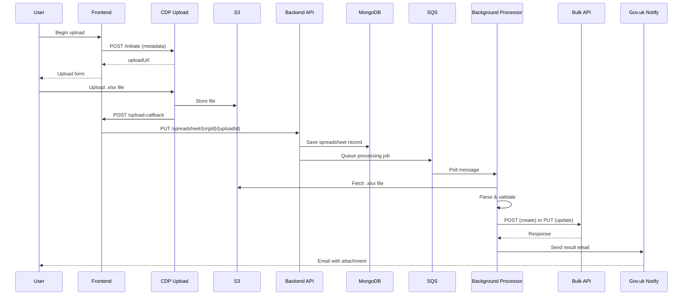
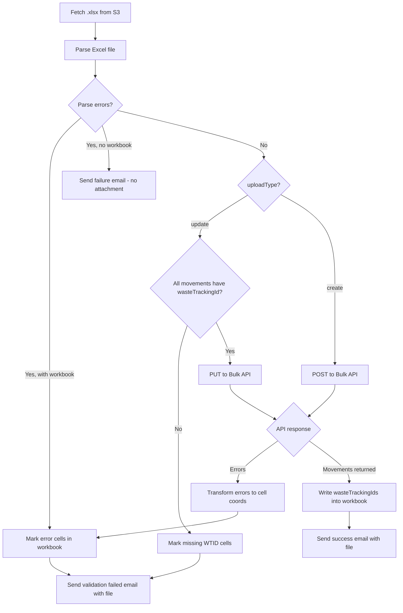

# Spreadsheet Upload Processing

End-to-end flow for uploading waste movement spreadsheets, from user interaction through to email notification.

## High-Level Flow

```
  User        Frontend       CDP Upload        S3         Backend API     MongoDB       SQS       Background       Bulk API     Gov.uk
                                                                                                  Processor                     Notify
   |              |               |             |              |             |            |            |               |            |
   |--Begin------>|               |             |              |             |            |            |               |            |
   |  upload      |--POST-------->|             |              |             |            |            |               |            |
   |              |  /initiate    |             |              |             |            |            |               |            |
   |              |<--uploadUrl---|             |              |             |            |            |               |            |
   |<-Upload form-|               |             |              |             |            |            |               |            |
   |              |               |             |              |             |            |            |               |            |
   |--Upload .xlsx--------------->|             |              |             |            |            |               |            |
   |              |               |--Store----->|              |             |            |            |               |            |
   |              |               |             |              |             |            |            |               |            |
   |              |<--POST--------|             |              |             |            |            |               |            |
   |              |  /callback    |             |              |             |            |            |               |            |
   |              |--PUT /spreadsheet---------->|              |             |            |            |               |            |
   |              |               |             |              |--Save------>|            |            |               |            |
   |              |               |             |              |--Queue msg-------------->|            |               |            |
   |              |               |             |              |             |            |            |               |            |
   |              |               |             |              |             |            |--Poll----->|               |            |
   |              |               |             |<-----------Fetch .xlsx------------------|               |            |
   |              |               |             |              |             |            |  Parse &   |               |            |
   |              |               |             |              |             |            |  validate  |               |            |
   |              |               |             |              |             |            |            |--POST/PUT---->|            |
   |              |               |             |              |             |            |            |<--Response----|            |
   |              |               |             |              |             |            |            |--Send email-------------->|
   |<--Email with attachment--------------------------------------------------------------------|               |            |
   |              |               |             |              |             |            |            |               |            |
```

<details>
<summary>Mermaid version</summary>



</details>

## Components

### Frontend (`waste-organisation-frontend`)

| File                                              | Role                               |
| ------------------------------------------------- | ---------------------------------- |
| `src/server/spreadsheet/index.js`                 | Route registration                 |
| `src/server/spreadsheet/controller.js`            | Upload handlers                    |
| `src/server/common/helpers/cdp-upload.js`         | CDP upload initiation and callback |
| `src/server/common/helpers/encryption/encrypt.js` | Email encryption (AES-256-GCM)     |
| `src/server/common/plugins/backendApi/index.js`   | Backend HTTP client                |

### Backend (`waste-organisation-backend`)

| File                                | Role                                          |
| ----------------------------------- | --------------------------------------------- |
| `src/routes/spreadsheet.js`         | REST endpoints, SQS scheduling                |
| `src/domain/spreadsheet.js`         | Joi validation schema                         |
| `src/repositories/spreadsheet.js`   | MongoDB data access                           |
| `src/backgroundProcessor.js`        | SQS polling, job orchestration                |
| `src/services/spreadsheetImport.js` | Excel parsing, validation, cell error marking |
| `src/services/bulkImport.js`        | Bulk API HTTP client (POST/PUT)               |
| `src/services/notify/index.js`      | Gov.uk Notify email sending                   |
| `src/services/decrypt.js`           | Email decryption                              |

## Step-by-Step

### 1. User initiates upload (Frontend)

**Route:** `GET /organisation/{organisationId}/spreadsheet/begin-upload`

The `beginUpload` controller calls `initiateUpload()` which:

1. Encrypts the user's email with AES-256-GCM, producing `[iv, ciphertext, tag]` (base64 strings)
2. POSTs to the CDP upload service at `/initiate` with:
   - `s3Bucket` destination
   - `callback` URL pointing back to the frontend
   - `redirect` URL for after upload completes
   - `metadata` containing the encrypted email, a pre-shared key, and `uploadType` (`'create'` or `'update'`)
3. Returns an `uploadUrl` which is rendered as the form action

The user submits their `.xlsx` file to the CDP upload service, which stores it in S3 and calls back to the frontend.

### 2. CDP callback (Frontend)

**Route:** `POST /organisation/{organisationId}/spreadsheet/upload-callback`

This is an open (unauthenticated) route called by the CDP upload service. The callback handler:

1. Validates the pre-shared key from `metadata`
2. Extracts `encryptedEmail` and `uploadType` from metadata
3. Extracts file details (S3 location, checksums, content type)
4. Calls `backendApi.saveSpreadsheet()` which PUTs to the backend

### 3. Store and queue (Backend API)

**Route:** `PUT /spreadsheet/{organisationId}/{uploadId}`

1. Merges request data with any existing record (optimistic locking)
2. Validates against `spreadsheetSchema` (includes `uploadType: 'create' | 'update'`)
3. Saves to MongoDB `spreadsheets` collection
4. Sends an SQS message to trigger background processing

**SQS message body:**

```json
{
  "s3Bucket": "waste-uploads",
  "s3Key": "path/to/file.xlsx",
  "encryptedEmail": ["iv_b64", "ciphertext_b64", "tag_b64"],
  "organisationId": "uuid",
  "uploadId": "uuid",
  "uploadType": "create"
}
```

### 4. Background processing

The background processor polls SQS (long polling, 20s wait, up to 10 messages per batch). For each message it runs `processSpreadsheet`:



### 5. Excel parsing (`spreadsheetImport.js`)

The spreadsheet has two data worksheets:

- **"7. Waste movement level"** -- one row per movement (columns B-AF)
- **"8. Waste item level"** -- one row per waste item (columns B-S)

Movements and items are linked by `yourUniqueReference` (column C in movements, column B in items). A movement can have multiple waste items.

Column B in the movements sheet holds the `wasteTrackingId` -- populated for update uploads, empty for create uploads.

Data rows start at row 9 (rows 1-8 are headers). Column mappings are defined as arrays (`movementMapping`, `itemMapping`) where each index corresponds to a column number and contains the JSON path to write the value into.

Parsing produces:

- An array of movement objects with nested `wasteItems`
- A `rowNumbers` lookup mapping `yourUniqueReference` to Excel row numbers (used for error reporting)

### 6. Bulk API call

Both create and update use the same endpoint URL (`/bulk/{bulkUploadId}/movements/receive`) with different HTTP methods:

| Upload type | HTTP method | Function       | wasteTrackingId                      |
| ----------- | ----------- | -------------- | ------------------------------------ |
| `create`    | POST        | `bulkImport()` | Not present -- API generates new IDs |
| `update`    | PUT         | `bulkUpdate()` | Required on each movement            |

Authentication is HTTP Basic Auth.

**Success response:** `{ movements: [{ wasteTrackingId: "ABC123" }, ...] }`

**Error response (400):** Validation errors array with key paths (e.g. `0.wasteItems.0.ewcCodes.0`) that get mapped back to Excel cell coordinates.

### 7. Email notification

All emails are sent via Gov.uk Notify. The encrypted email is decrypted in the background processor before sending.

| Outcome                                 | Template                 | Attachment                                                      |
| --------------------------------------- | ------------------------ | --------------------------------------------------------------- |
| Success                                 | `successTemplate`        | Excel with wasteTrackingIds populated in column B               |
| Validation failed (parse or API errors) | `failedWithFileTemplate` | Excel with error cells highlighted red and messages in column A |
| Invalid file (not Excel)                | `failedTemplate`         | None                                                            |

## Create vs Update

The `uploadType` determines how the spreadsheet is processed. Both types share the same parsing and error-handling pipeline but diverge at validation and the bulk API call.

```
                          ┌──────────────────────────────────┐
                          │   Parse Excel & join movements   │
                          │        (shared for both)         │
                          └───────────────┬──────────────────┘
                                          │
                          ┌───────────────┴──────────────────┐
                          │                                  │
                   uploadType=create                  uploadType=update
                          │                                  │
              ┌───────────┴───────────┐         ┌────────────┴────────────┐
              │ Validate no           │         │ Validate wasteTrackingId│
              │ wasteTrackingId on    │         │ present on every row    │
              │ any row               │         └────────────┬────────────┘
              └───────────┬───────────┘               pass   │   fail
                   pass   │   fail                   ┌───────┴───────┐
                  ┌───────┴───────┐                  │               │
                  │               │          PUT /movements    Error email
           POST /movements  Error email      (bulkUpdate)      with marked
           (bulkImport)     with marked            │           spreadsheet
                  │         spreadsheet
                          │                          │
                          └──────────┬───────────────┘
                                     │
                          ┌──────────┴──────────┐
                          │  Handle API response │
                          │    (shared logic)    │
                          └─────────────────────┘
```

### Validation differences

| Validation step                                               | Create | Update |
| ------------------------------------------------------------- | ------ | ------ |
| File is valid Excel                                           | Yes    | Yes    |
| Column data parsing (types, codes, formats)                   | Yes    | Yes    |
| Every movement has at least one waste item                    | Yes    | Yes    |
| Every waste item maps to a movement                           | Yes    | Yes    |
| `wasteTrackingId` (column B) must be empty                    | Yes    | No     |
| `wasteTrackingId` (column B) present on every movement        | No     | Yes    |
| Bulk API schema validation (EWC codes, required fields, etc.) | Yes    | Yes    |

### Column B (`wasteTrackingId`)

For **create** uploads, column B in the movements worksheet must be empty. If any row has a waste tracking ID, the upload fails with a validation error before reaching the API. After a successful bulk API call, the API returns newly generated waste tracking IDs which are written back into column B of the workbook before emailing the user.

For **update** uploads, column B must already contain a waste tracking ID on every movement row. These IDs are read during parsing and included in the PUT request so the bulk API knows which existing movements to update. If any row is missing a waste tracking ID, the upload fails before reaching the API.

### Bulk API endpoint

Both types hit the same URL: `/bulk/{bulkUploadId}/movements/receive`

|                                    | Create                                 | Update                                 |
| ---------------------------------- | -------------------------------------- | -------------------------------------- |
| HTTP method                        | POST                                   | PUT                                    |
| Function                           | `bulkImport()`                         | `bulkUpdate()`                         |
| `wasteTrackingId` on each movement | Not sent                               | Required                               |
| API generates new IDs              | Yes                                    | No                                     |
| API response on success            | `{ movements: [{ wasteTrackingId }] }` | `{ movements: [{ wasteTrackingId }] }` |
| API response on error              | `{ errors: [...] }`                    | `{ errors: [...] }`                    |

## Email encryption

The user's email address is never stored in plain text in S3, MongoDB, or SQS. It is encrypted in the frontend before being passed through the CDP upload service metadata, and only decrypted in the background processor immediately before sending.

- **Algorithm:** AES-256-GCM
- **Format:** `[iv_base64, ciphertext_base64, authTag_base64]`
- **Key:** Shared 32-byte key (base64-encoded) in both frontend and backend config
